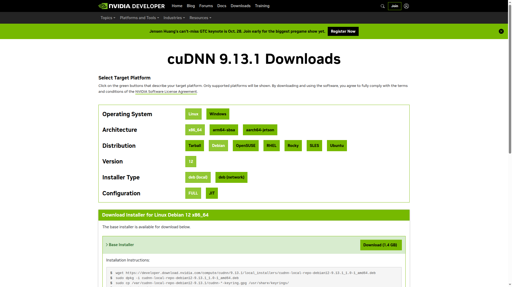

# Deep Learning Framework Installation on Ubuntu MATE 24.04 LTS
* I recommend that you should ignore the commented instructions with an octothorpe, #.
* I recommend that you should type the sercert strings with an barakets, <>.


## Table of contents
- [Deep Learning Framework Installation on Ubuntu MATE 24.04 LTS](#deep-learning-framework-installation-on-ubuntu-mate-2404-lts)
  - [Table of contents](#table-of-contents)
  - [1. Summarized environments about the DL-UbuntuMATE-Installation ](#1-summarized-environments-about-the-dl-ubuntumate-installation-)
  - [2. How to set an additional language ](#2-how-to-set-an-additional-language-)
  - [3. How to remove unused packages ](#3-how-to-remove-unused-packages-)
    - [Snap packages](#snap-packages)
  - [4. How to install useful packages ](#4-how-to-install-useful-packages-)
    - [Debian packages](#debian-packages)
    - [Snap packages](#snap-packages-1)
  - [5. How to install a GPU driver ](#5-how-to-install-a-gpu-driver-)
  - [6. How to install a CUDA toolkit ](#6-how-to-install-a-cuda-toolkit-)
  - [7. How to install a cuDNN ](#7-how-to-install-a-cudnn-)
  - [8. How to uninstall the GPU driver, CUDA toolkit and cuDNN ](#8-how-to-uninstall-the-gpu-driver-cuda-toolkit-and-cudnn-)
  - [9. How to install other version of the python3 ](#9-how-to-install-other-version-of-the-python3-)
  - [10. How to install and use pip3 and venv ](#10-how-to-install-and-use-pip3-and-venv-)
  - [11. How to install a PyTorch ](#11-how-to-install-a-pytorch-)
  - [12. How to install both TensorRT and Torch2TRT ](#12-how-to-install-both-tensorrt-and-torch2trt-)
  - [13. Development tools ](#13-development-tools-)
    - [Git](#git)
    - [Vim](#vim)
    - [Visual Studio Code](#visual-studio-code)
    - [bashrc](#bashrc)
    - [Docker and NVIDIA-Container-Toolkit](#docker-and-nvidia-container-toolkit)
  - [14. File system ](#14-file-system-)
    - [NTFS](#ntfs)
    - [exFAT](#exfat)
  - [15. File mode ](#15-file-mode-)


## 1. Summarized environments about the DL-UbuntuMATE-Installation <a name="envs"></a>
* Operating System (OS): Ubuntu MATE 24.04.3 LTS
* Graphics Processing Unit (GPU): NVIDIA TITAN Xp, 1ea
* GPU driver: NVIDIA-580.02.09
* CUDA toolkit: 12.8
* cuDNN: 9.13.1
* PyTorch: 2.6.0


## 2. How to set an additional language <a name="language"></a>
A. Run the Language Support program and install it completely.

B. Install the debian package, IBus.
```bash
$ sudo apt-get install ibus
```

C. Select the IBus option for a keyboard input method system.
<br /> 

D. Logout and login the OS.

E. Run the ibus-setup.
```bash
$ ibus-setup
```

F. Add the Korean - Hangul at the Input Method tap.
<br /> 

G. Logout and login the OS.

H. Set the language at the upper right corner of the desktop.


## 3. How to remove unused packages <a name="remove_packages"></a>
```bash
$ sudo snap remove firefox
$ sudo apt-get remove nano
```


## 4. How to install useful packages <a name="install_packages"></a>
### Debian packages
A. Web browser: <a href="https://www.google.com/chrome" title="Google Chrome"> Google Chrome</a>.

B. Others: usb-creator-gtk, curl, terminator, git, vim, gedit, audacity, filezilla and openssh-server.
```bash
$ sudo apt-get install usb-creator-gtk curl terminator git vim gedit audacity filezilla openssh-server
```

### Snap packages
A. <a href="https://snapcraft.io/install/kolourpaint/ubuntu" title="Kolourpaint"> Kolourpaint</a>.
```bash
$ sudo snap install kolourpaint
```

B. <a href="https://remmina.org" title="Remmina"> Remmina</a>.
* Instsall the Remmina.
* Set the Remmina remote desktope preference.
```bash
$ sudo snap install remmina
```
<br /> 


## 5. How to install a GPU driver <a name="gpu_driver"></a>
A. Check a NVIDIA driver version with reference to the website, <a href="https://www.nvidia.com/Download/Find.aspx" title="NVIDIA driver"> NVIDIA driver</a>.
<br /> 

B. Install the NVIDIA driver which user selects.
```bash
$ sudo add-apt-repository ppa:graphics-drivers/ppa
$ sudo apt-get update
$ sudo apt-get install nvidia-driver-580
$ sudo reboot
```

C. Check the installed NVIDIA driver version.
```bash
$ nvidia-smi
```
```bash
    Wed Oct  8 00:12:25 2025       
    +-----------------------------------------------------------------------------------------+
    | NVIDIA-SMI 580.82.09              Driver Version: 580.82.09      CUDA Version: 13.0     |
    +-----------------------------------------+------------------------+----------------------+
    | GPU  Name                 Persistence-M | Bus-Id          Disp.A | Volatile Uncorr. ECC |
    | Fan  Temp   Perf          Pwr:Usage/Cap |           Memory-Usage | GPU-Util  Compute M. |
    |                                         |                        |               MIG M. |
    |=========================================+========================+======================|
    |   0  NVIDIA TITAN Xp                Off |   00000000:02:00.0  On |                  N/A |
    | 23%   41C    P5             28W /  250W |     468MiB /  12288MiB |      1%      Default |
    |                                         |                        |                  N/A |
    +-----------------------------------------+------------------------+----------------------+

    +-----------------------------------------------------------------------------------------+
    | Processes:                                                                              |
    |  GPU   GI   CI              PID   Type   Process name                        GPU Memory |
    |        ID   ID                                                               Usage      |
    |=========================================================================================|
    |    0   N/A  N/A            5378      G   /usr/lib/xorg/Xorg                      262MiB |
    |    0   N/A  N/A            6883      G   ...144 --variations-seed-version         80MiB |
    |    0   N/A  N/A           13530      G   /usr/share/code/code                    113MiB |
    +-----------------------------------------------------------------------------------------+
```


## 6. How to install a CUDA toolkit <a name="cuda_toolkit"></a>
A. Download a CUDA toolkit with reference to the websites, <a href="https://developer.nvidia.com/cuda-downloads" title="CUDA toolkit"> CUDA toolkit</a> and <a href="https://developer.nvidia.com/cuda-toolkit-archive" title="CUDA toolkit archive"> CUDA toolkit archive</a>.
<br /> 

B. Install the CUDA toolkit which user selects.
```bash
$ wget https://developer.download.nvidia.com/compute/cuda/12.8.0/local_installers/cuda_12.8.0_570.86.10_linux.run
$ sudo sh cuda_12.8.0_570.86.10_linux.run
```
```bash
    # Ignore the below warning and just select a option, Continue.
    ┌──────────────────────────────────────────────────────────────────────────────┐
    │ Existing package manager installation of the driver found. It is strongly    │
    │ recommended that you remove this before continuing.                          │
    │ Abort                                                                        │
    │ (Continue)                                                                   │
    │                                                                              │
    │                                                                              │
    │                                                                              │
    │                                                                              │
    │                                                                              │
    │                                                                              │
    │                                                                              │
    │                                                                              │
    │                                                                              │
    │                                                                              │
    │                                                                              │
    │                                                                              │
    │                                                                              │
    │                                                                              │
    │                                                                              │
    │                                                                              │
    │                                                                              │
    │                                                                              │
    │ Up/Down: Move | 'Enter': Select                                              │
    └──────────────────────────────────────────────────────────────────────────────┘

    ┌──────────────────────────────────────────────────────────────────────────────┐
    │  End User License Agreement                                                  │
    │  --------------------------                                                  │
    │                                                                              │
    │  NVIDIA Software License Agreement and CUDA Supplement to                    │
    │  Software License Agreement.                                                 │
    │                                                                              │
    │                                                                              │
    │  Preface                                                                     │
    │  -------                                                                     │
    │                                                                              │
    │  The Software License Agreement in Chapter 1 and the Supplement              │
    │  in Chapter 2 contain license terms and conditions that govern               │
    │  the use of NVIDIA software. By accepting this agreement, you                │
    │  agree to comply with all the terms and conditions applicable                │
    │  to the product(s) included herein.                                          │
    │                                                                              │
    │                                                                              │
    │  NVIDIA Driver                                                               │
    │                                                                              │
    │                                                                              │
    │──────────────────────────────────────────────────────────────────────────────│
    │ Do you accept the above EULA? (accept/decline/quit):                         │
    │ (accept)                                                                     │
    └──────────────────────────────────────────────────────────────────────────────┘

    ┌──────────────────────────────────────────────────────────────────────────────┐
    │ CUDA Installer                                                               │
    │ - [ ] Driver                                                                 │
    │      [ ] 570.86.10                                                           │
    │ - [X] CUDA Toolkit 12.8                                                      │
    │    + [X] CUDA Libraries 12.8                                                 │
    │    + [X] CUDA Tools 12.8                                                     │
    │    + [X] CUDA Compiler 12.8                                                  │
    │   [ ] CUDA Demo Suite 12.8                                                   │
    │   [ ] CUDA Documentation 12.8                                                │
    │ - [ ] Kernel Objects                                                         │
    │      [ ] nvidia-fs                                                           │
    │   Options                                                                    │
    │   Install                                                                    │
    │                                                                              │
    │                                                                              │
    │                                                                              │
    │                                                                              │
    │                                                                              │
    │                                                                              │
    │                                                                              │
    │                                                                              │
    │                                                                              │
    │ Up/Down: Move | Left/Right: Expand | 'Enter': Select | 'A': Advanced options │
    └──────────────────────────────────────────────────────────────────────────────┘
```

C. Ignore the below warning about incompleted installation.
```bash
    ===========
    = Summary =
    ===========

    Driver:   Not Selected
    Toolkit:  Installed in /usr/local/cuda-12.8/

    Please make sure that
    -   PATH includes /usr/local/cuda-12.8/bin
    -   LD_LIBRARY_PATH includes /usr/local/cuda-12.8/lib64, or, add /usr/local/cuda-12.8/lib64 to /etc/ld.so.conf and run ldconfig as root

    To uninstall the CUDA Toolkit, run cuda-uninstaller in /usr/local/cuda-12.8/bin
    ***WARNING: Incomplete installation! This installation did not install the CUDA Driver. A driver of version at least 570.00 is required for CUDA 12.8 functionality to work.
    To install the driver using this installer, run the following command, replacing <CudaInstaller> with the name of this run file:
        sudo <CudaInstaller>.run --silent --driver

    Logfile is /var/log/cuda-installer.log
```

D. Make sure that CUDA path and LD_LIBRARY_PATH.
```bash
$ echo -e "\n## CUDA and cuDNN paths"  >> ~/.bashrc
$ echo 'export PATH=/usr/local/cuda-12.8/bin${PATH:+:${PATH}}' >> ~/.bashrc
$ echo 'export LD_LIBRARY_PATH=/usr/local/cuda-12.8/lib64${LD_LIBRARY_PATH:+:${LD_LIBRARY_PATH}}' >> ~/.bashrc
$ source ~/.bashrc
$ sudo reboot
```

E. Check the installed CUDA toolkit version.
```bash
$ nvcc --version
```
```bash
    nvcc: NVIDIA (R) Cuda compiler driver
    Copyright (c) 2005-2025 NVIDIA Corporation
    Built on Wed_Jan_15_19:20:09_PST_2025
    Cuda compilation tools, release 12.8, V12.8.61
    Build cuda_12.8.r12.8/compiler.35404655_0
```
```bash
$ which nvcc
```
```bash
    /usr/local/cuda-12.8/bin/nvcc
```

F. Make a symbolic link when changing another installed CUDA toolkit.
```bash
$ sudo rm -rf /usr/local/cuda
$ sudo ln -s /usr/local/cuda-12.8 /usr/local/cuda
$ sudo readlink -f /usr/local/cuda
```
```bash
    /usr/local/cuda-12.8
```


## 7. How to install a cuDNN <a name="cudnn"></a>
A. Download a cuDNN with reference to the websites, <a href="https://developer.nvidia.com/rdp/cudnn-download" title="cuDNN"> cuDNN</a> and <a href="https://developer.nvidia.com/rdp/cudnn-archive" title="cuDNN archive"> cuDNN archive</a>.
<br /> 

B. Install the downloaded cuDNN.
```bash
$ wget https://developer.download.nvidia.com/compute/cudnn/9.13.1/local_installers/cudnn-local-repo-debian12-9.13.1_1.0-1_amd64.deb
$ sudo dpkg -i cudnn-local-repo-debian12-9.13.1_1.0-1_amd64.deb
$ sudo cp /var/cudnn-local-repo-debian12-9.13.1/cudnn-*-keyring.gpg /usr/share/keyrings/
$ sudo apt-get update
$ sudo apt-get -y install cudnn
```


## 8. How to uninstall the GPU driver, CUDA toolkit and cuDNN <a name="uninstall_CUDAs"></a>
A. uninstall the GPU driver, CUDA toolkit and cuDNN.
```bash
$ sudo /usr/local/cuda-12.8/bin/cuda-uninstaller
$ sudo apt-get remove --purge -y 'cuda*'
$ sudo apt-get remove --purge -y 'nvidia*'
$ sudo apt-get autoremove --purge cuda
$ sudo rm -rf /usr/local/cuda*
```


## 9. How to install other version of the python3 <a name="python3_version"></a>
A. Install the other version of the python3: python3.7 (e.g. python3.7.9).
* To be installed: python3.7
```bash
$ sudo apt-get update
$ sudo apt-get install software-properties-common
$ sudo add-apt-repository ppa:deadsnakes/ppa
$ sudo apt-get install python3.7
```

B. Make a symbolic link when changing the version of the python3.
```bash
$ sudo rm -rf /usr/bin/python3
$ sudo ln -s /usr/bin/python3.7 /usr/bin/python3
$ sudo readlink -f /usr/bin/python3
```
```bash
    /usr/bin/python3.7
```


## 10. How to install and use pip3 and venv <a name="pip3_venv"></a>
Check the pip, pip3 and virtualenv usages with reference to the websites, <a href="https://pip.pypa.io/en/stable/" title="pip3"> pip3</a> and <a href="https://docs.python.org/3/library/venv.html#module-venv" title="venv"> venv</a>.
```bash
$ sudo apt-get install python3-pip python3.12-venv
```


## 11. How to install a PyTorch <a name="pytorch"></a>
A. Check a PyTorch version with reference to the website, <a href="https://pytorch.org" title="PyTorch"> PyTorch</a>.

B. Install the PyTorch where user want to install it.
```bash
$ pip install torch==2.6.0 torchvision==0.21.0 torchaudio==2.6.0 --index-url https://download.pytorch.org/whl/cu126
```

C. Make sure the PyTorch is installed correctly.
```bash
(PyTorch) $ python3
```
```python
    Python 3.12.3 (main, Aug 14 2025, 17:47:21) [GCC 13.3.0] on linux
    Type "help", "copyright", "credits" or "license" for more information.
    >>> import torch
    >>> torch.__version__
    '2.6.0+cu126'
    >>> torch.cuda.is_available()
    True
    >>> torch.cuda.device_count()
    1
    >>> torch.cuda.get_device_name(0)
    'TITAN Xp'
    >>> device = torch.device('cuda')
    >>> print(str(device))
    'cuda'
    >>> a = torch.rand(5)
    >>> b = a.to(device)
    >>> c = a.to('cuda:0')
    >>> print(a)
    tensor([0.4732, 0.1292, 0.7363, 0.6000, 0.2162])
    >>> print(b)
    tensor([0.4732, 0.1292, 0.7363, 0.6000, 0.2162], device='cuda:0')
    >>> print(c)
    tensor([0.4732, 0.1292, 0.7363, 0.6000, 0.2162], device='cuda:0')
```


## 12. How to install both TensorRT and Torch2TRT <a name="tensorrt_torch2trt"></a>
A. Reference to the website, <a href="https://github.com/vujadeyoon/TensorRT-Torch2TRT" title="TensorRT-Torch2TRT">TensorRT-Torch2TRT</a>.


## 13. Development tools <a name="dev_tools"></a>
### Git
A. How to set name and eamil globally.
```bash
$ git config --global user.name ${username}
$ git config --global user.email ${useremail}
```

B. How to ignore a notice for difference of the file mode.
```bash
    old mode 100755
    new mode 100644
```
```bash
$ git config core.filemode false
```

### Vim
A. How to set numbers globally.
```bash
$ vi ~/.vimrc
set number
set ts=8
set sw=4
set sts=4
set smartindent
set cindent
:wq
```

### Visual Studio Code
A. How to open the Settings.
```bash
Ctrl + ,
```

B. Useful extensions.
* Markdown Preview Enhanced
* Diff Folders

C. How to set live preview.
* Open the Settings and search the string, Auto Save.
* Set the variables.
    * Files: Auto Save: afterDelay
    * Files: Auto Save Delay: 500
* Duplicate the window
```bash
F1 + Workspaces: Duplicate As workspace in New Window
```

D. How to edit font ligatures.
* Open the settings.json for the font ligatures.
    * Open the Settings.
    * Search the settings.
    * Click the button, Edit in the settings.json in the section, Editor: Font Ligatrues.
* Replace the json file.
```
{
    "workbench.colorTheme": "Quiet Light",
    "python.defaultInterpreterPath": "/usr/bin/python3",
    "editor.suggestSelection": "first",
    "vsintellicode.modify.editor.suggestSelection": "automaticallyOverrodeDefaultValue",
    "files.autoSave": "afterDelay",
    "files.autoSaveDelay": 500,
    "[json]": {
        "editor.quickSuggestions": {
            "strings": true
        },
        "editor.suggest.insertMode": "replace"
    },

    // Custom
    // Minimap
    "editor.minimap.enabled": false,
    // Color
    "workbench.colorCustomizations": {
        // Totally Transparent
        "editor.findMatchHighlightBackground": "#ffff0050",
        // Borders
        "editor.selectionHighlightBorder": "#ff0000",
        "editor.lineHighlightBorder": "#00000020",
        // Selection
        "editor.findMatchBackground": "#ffff00",
        "editor.findMatchBorder": "#ff0000",
        // Misc
        "editorCursor.foreground": "#000000",
        "editor.lineHighlightBackground": "#E3F5D3",

    },
    "window.zoomLevel": -1,
    "editor.fontLigatures": null
}
```

### bashrc
A. How to edit bashrc.
```bash
$ vi ~/.bashrc
```

B. How to apply bashrc.
```bash
$ source ~/.bashrc
```

C. Useful functions.
* vid2frm.
```bash
## vid2frm: Video to frames.
function vid2frm() {
  case $1 in
    -h|--help)
    echo "Usage: vid2frm name_video.mp4"
    ;;
    *)
    path_file=$1
    filename_extension="${path_file##*/}" # "$(basename -- $path_file)"
    filename=${filename_extension%.*}
    extension=".${path_file##*.}"
    rm -rf ./$filename
    mkdir -p ./$filename
    ffmpeg -i $1 -start_number 0 ./$filename/frm_%08d.png
    ;;
  esac
}
```
* git_init.
```bash
## Git init.
function git_init() {
    number_commit=$1
    rm -rf .git
    git init
    git add .
    git commit -m "git init: ${number_commit}"
}
```
* github_token.
```bash
## Get GitHub token.
function github_token() {
    echo "GitHub token: <github_token>"
}
```
* csv2ods.
```bash
## Convert CSV to ODS.
function csv2ods() {
    soffice --convert-to ods $1
}
```
* docker_connect.
```bash
## docker_connect
function docker_connect() {
    # $1: Name for docker iamge, image:tag.
    # $2: Path volume
    sudo docker run -it --rm --privileged --runtime nvidia -p 10001:11001 -v $2 $1 /bin/bash
}
```

### Docker and NVIDIA-Container-Toolkit
Refer to <a href="https://docs.nvidia.com/datacenter/cloud-native/container-toolkit/install-guide.html#docker" title="NVIDIA Container-toolkit"> NVIDIA Container-toolkit</a> and <a href="https://github.com/vujadeyoon/Docker-Nvidia-Container-Toolkit" title="Docker-Nvidia-Container-Toolkit"> Docker-Nvidia-Container-Toolkit</a>.


## 14. File system <a name="file_system"></a>
### NTFS
A. How to fix NTFS disk write-protect.
```bash
$ sudo ntfsfix /dev/sdb1
```

### exFAT
A. How to enable a file system, exFAT.
```bash
$ sudo apt-get install exfat-utils exfat-fuse
```

## 15. File mode <a name="file_mode"></a>
A. How to change the mode of the given current directory recursively.
* Recommend mode of file: 755.
```bash
$ find ./ -type d -exec chmod -R -v 755 {} \;
```

B. How to change the mode of the given current file recursively.
* Recommend mode of file: 644.
```bash
$ find ./ -type f -exec chmod -R -v 644 {} \;
```
